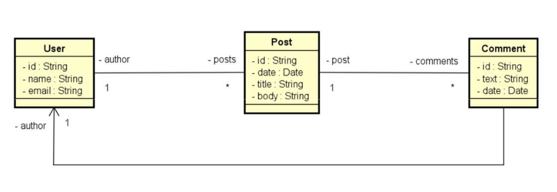

#  Posts API

API RESTful desenvolvida em **Java** com **Spring Boot**, utilizando **MongoDB** como banco de dados e gerenciada com **Maven**.  
Ela permite o gerenciamento de usuários, posts e comentários de forma simples e eficiente.

----------

##  Tecnologias utilizadas

-   Java 17+
    
-   Spring Boot
    
-   Spring Data MongoDB
    
-   Maven
    
-   MongoDB
    
-   Insomnia (para testes)
    

----------

##  Modelo de Domínio



----------

##  Endpoints disponíveis

GET `/users`

POST `/users`

PUT `/users`

DELETE `/users/{id}`

GET `/posts`

POST `/posts`

PUT `/posts/:id`

DELETE `/posts`

POST `/posts/:id/comment`

PUT `/posts/:id/comment/index`

DELETE `/posts/{id}/comment/{index}/author/{userId}`

----------

##  Como rodar o projeto localmente

```bash
# Clone o repositório
git clone git@github.com:JuniorPaula/post-api-java.git

# Acesse o diretório
cd posts-api

# Execute a aplicação
./mvnw spring-boot:run

```

Certifique-se de que o MongoDB esteja rodando localmente na porta padrão (`27017`).

----------
